<!--
  ✏️  HOW TO EDIT
  Search this file for "EDIT" to find every spot to personalise.
  Colours: blue #2563EB → cyan #06B6D4. To change them, replace these two hex codes
  here and in assets/*.svg.
-->

<!-- EDIT: the banner title ("desc") after desc=, e.g. AI%20Engineer -->
<picture>
  <source media="(prefers-color-scheme: dark)" srcset="https://capsule-render.vercel.app/api?type=venom&height=200&color=0:2563EB%2C100:06B6D4&text=Uday%20Bhan&fontSize=55&animation=fadeIn&fontAlignY=35&desc=AI%20Engineer&descSize=20&descAlignY=55&fontColor=ffffff">
  <source media="(prefers-color-scheme: light)" srcset="https://capsule-render.vercel.app/api?type=venom&height=200&color=0:2563EB%2C100:06B6D4&text=Uday%20Bhan&fontSize=55&animation=fadeIn&fontAlignY=35&desc=AI%20Engineer&descSize=20&descAlignY=55&fontColor=1f2328">
  
</picture>

<!-- EDIT: typing lines. Separate with ";" and use "+" for spaces -->
<p align="center">
  <a href="https://github.com/udaybhan05"></a>
</p>

<p align="center">
  <a href="mailto:uday.singh@auropro.com"></a>
  &nbsp;
  <a href="https://github.com/udaybhan05?tab=followers"></a>
</p>

<p align="center">
  <!-- EDIT: one line on where you work and what you focus on -->
  <sub>AI Engineer @ AuroPro &nbsp;·&nbsp; Agentic RAG &amp; GraphRAG &nbsp;·&nbsp; Chatbots &nbsp;·&nbsp; MCP &nbsp;·&nbsp; AWS · Azure · GCP</sub>
</p>

<picture>
  <source media="(prefers-color-scheme: dark)" srcset="assets/h-about-dark.svg">
  <source media="(prefers-color-scheme: light)" srcset="assets/h-about-light.svg">
  
</picture>

<!-- EDIT: 1–2 sentences in your own words -->
I build **production AI systems that answer from real knowledge**: agentic RAG and GraphRAG pipelines, LLM chatbots, and MCP servers and connectors that plug agents into real data and tools. I ship them to **AWS, Azure and Google Cloud**, with evaluation and observability built in from day one. I also keep my fundamentals sharp with data structures and algorithms in Java.

<!-- EDIT: keep only the rows and tools you actually use -->
| Focus area | Working with |
|:-----------|:-------------|
| **Agentic AI** | `LangGraph` `ReAct + tool calling` `Multi-agent` `AG-UI / CopilotKit` |
| **GraphRAG & retrieval** | `Neo4j` `Weaviate` `Hybrid search + RRF` `Text-to-SQL / Cypher` |
| **Chatbots** | `Conversational RAG` `Streaming (SSE)` `Memory` `Guardrails` |
| **MCP & connectors** | `MCP servers` `Tool registries` `Data connectors` `API integrations` |
| **Cloud deployment** | `AWS` `Azure` `Google Cloud (GCP)` `Docker` |
| **LLM gateway** | `LiteLLM` `Vertex AI` `Anthropic` `OpenAI` |
| **Evals & observability** | `Arize Phoenix` `LLM-as-judge` `Golden suites` `Online eval` |
| **Problem solving** | `Java` `Data structures` `Algorithms` `LeetCode` |

### Now building

| Project | What it is |
|:--------|:-----------|
| [Retrieval Agent (Thinky)](https://github.com/udaybhan05/Agentic_Graph_Rag_Fusion_30_may) | Production agentic retrieval service: LangGraph + Weaviate/Neo4j hybrid search with RRF |
| [RAG_Mastery](https://github.com/udaybhan05/RAG_Mastery) | A collection of RAG techniques, from basic to advanced |

### Tracking the frontier

Where AI engineering is heading, and where I'm hands-on:

| Frontier | My work there |
|:---------|:--------------|
| **Agentic AI:** agents that plan, call tools and check their own answers | <ul><li>Two-tier LangGraph agent with a cheap gate model, a strong agent model and a parallel judge in <a href="https://github.com/udaybhan05/Agentic_Graph_Rag_Fusion_30_may">Thinky</a></li></ul> |
| **GraphRAG:** knowledge graphs + vectors instead of vectors alone | <ul><li>Weaviate vector + Neo4j graph retrieval fused with Reciprocal Rank Fusion</li><li>Text-to-Cypher and text-to-SQL tools for structured questions</li></ul> |
| **MCP & connectors:** one protocol to plug agents into data and tools | <ul><li>MCP servers and connectors that expose enterprise data and tools to agents</li><li>Single tool registry discovered by the agent at runtime</li></ul> |
| **Context engineering:** memory and state over longer prompts | <ul><li>Conversation checkpointers (Postgres / SQLite) and cross-session user memory</li><li>Hot / warm / cold context compression to stay inside a token budget</li></ul> |
| **Agent protocols & UI:** streaming agents into real apps | <ul><li>AG-UI / CopilotKit streaming of tool calls and state to the frontend</li></ul> |
| **Evals & observability:** proving the answers are grounded | <ul><li>Arize Phoenix tracing, online hallucination / faithfulness scoring, golden suites</li></ul> |

### Chatbots & deployment

- Built and shipped **LLM chatbots**: conversational RAG over company knowledge, streaming answers, memory across turns
- Deployed AI services on **AWS**, **Microsoft Azure** and **Google Cloud (GCP)**, containerised with Docker
- Provider-agnostic model access through **LiteLLM**: Vertex AI, Anthropic, OpenAI and more behind one gateway

<p align="center">
  
  
  
  
</p>

<!-- EDIT (optional): uncomment and fill in your real career timeline
### The journey

| Years | Era | Proof |
|:------|:----|:------|
| 20XX–20XX | Foundations: Java, DSA | [LeetCodeRepo](https://github.com/udaybhan05/LeetCodeRepo) |
| 20XX–20XX | Data and ML | [pandas_exercises](https://github.com/udaybhan05/pandas_exercises) |
| 20XX–now | GenAI and RAG | [RAG_Mastery](https://github.com/udaybhan05/RAG_Mastery) · [RAG_Bot](https://github.com/udaybhan05/RAG_Bot) |
-->

<picture>
  <source media="(prefers-color-scheme: dark)" srcset="assets/h-featured-work-dark.svg">
  <source media="(prefers-color-scheme: light)" srcset="assets/h-featured-work-light.svg">
  
</picture>

<!-- EDIT: add results (accuracy, latency, dataset size) as you build them out -->
<table>
<tr>
<td width="50%" valign="top">
<h3><a href="https://github.com/udaybhan05/Agentic_Graph_Rag_Fusion_30_may">Retrieval Agent (Thinky)</a></h3>
<ul>
<li>Two-tier LangGraph agent: cheap gate model, strong agent model, parallel judge for grounding</li>
<li>Hybrid Weaviate + Neo4j retrieval fused with RRF, plus web, SQL and Cypher tools</li>
</ul>
<p><code>LangGraph</code> <code>Weaviate</code> <code>Neo4j</code> <code>LiteLLM</code></p>
</td>
<td width="50%" valign="top">
<h3><a href="https://github.com/udaybhan05/Agentic_Graph_Rag_Fusion_30_may">GraphRAG tool layer</a></h3>
<ul>
<li>Text-to-SQL and text-to-Cypher for structured questions</li>
<li>Web search, personal documents and domain knowledge bases behind one tool registry</li>
</ul>
<p><code>Neo4j</code> <code>Cypher</code> <code>SQL</code> <code>Tavily</code></p>
</td>
</tr>
<tr>
<td width="50%" valign="top">
<h3><a href="https://github.com/udaybhan05/Agentic_Graph_Rag_Fusion_30_may">Evals &amp; observability</a></h3>
<ul>
<li>Arize Phoenix tracing on every node, online hallucination and faithfulness scoring</li>
<li>Per-surface golden suites and Vertex AI pointwise metrics</li>
</ul>
<p><code>Phoenix</code> <code>LLM-as-judge</code> <code>Vertex AI</code></p>
</td>
<td width="50%" valign="top">
<h3><a href="https://github.com/udaybhan05/RAG_Mastery">RAG Mastery</a></h3>
<ul>
<li>RAG techniques end to end, from naive retrieval to advanced patterns</li>
<li>Each technique as a runnable, documented example</li>
</ul>
<p><code>Python</code> <code>RAG</code> <code>Vector DB</code></p>
</td>
</tr>
<tr>
<td width="50%" valign="top">
<h3><a href="https://github.com/udaybhan05/RAG_Bot">RAG Bot</a></h3>
<ul>
<li>Conversational chatbot answering questions over a CSV dataset</li>
<li>Retrieval-grounded answers instead of guesses</li>
</ul>
<p><code>Python</code> <code>RAG</code> <code>Chatbot</code></p>
</td>
<td width="50%" valign="top">
<h3><a href="https://github.com/udaybhan05/LeetCodeRepo">LeetCode Solutions</a></h3>
<ul>
<li>My solutions to LeetCode problems</li>
<li>Arrays, strings, trees, graphs, dynamic programming</li>
</ul>
<p><code>Java</code> <code>DSA</code></p>
</td>
</tr>
</table>

<picture>
  <source media="(prefers-color-scheme: dark)" srcset="assets/h-open-source-dark.svg">
  <source media="(prefers-color-scheme: light)" srcset="assets/h-open-source-light.svg">
  
</picture>

<!-- EDIT: list your merged PRs here as you make them, e.g.
<li>Fixed X in <a href="https://github.com/org/repo/pull/123">org/repo #123</a></li> -->
<p align="center">
  <a href="https://github.com/pulls?q=is%3Apr+author%3Audaybhan05+is%3Amerged"></a>
</p>

<picture>
  <source media="(prefers-color-scheme: dark)" srcset="assets/h-tech-stack-dark.svg">
  <source media="(prefers-color-scheme: light)" srcset="assets/h-tech-stack-light.svg">
  
</picture>

<!-- EDIT: skillicons ids are listed at https://skillicons.dev. Keep only what you use -->
<p align="center">
  <picture>
    <source media="(prefers-color-scheme: dark)" srcset="https://skillicons.dev/icons?i=python%2Cjava%2Cfastapi%2Cpytorch%2Csklearn%2Cflask&theme=dark">
    <source media="(prefers-color-scheme: light)" srcset="https://skillicons.dev/icons?i=python%2Cjava%2Cfastapi%2Cpytorch%2Csklearn%2Cflask&theme=light">
    
  </picture>
  <br/>
  <picture>
    <source media="(prefers-color-scheme: dark)" srcset="https://skillicons.dev/icons?i=aws%2Cazure%2Cgcp%2Cdocker%2Cgit%2Cgithub%2Clinux%2Cpostgres&theme=dark">
    <source media="(prefers-color-scheme: light)" srcset="https://skillicons.dev/icons?i=aws%2Cazure%2Cgcp%2Cdocker%2Cgit%2Cgithub%2Clinux%2Cpostgres&theme=light">
    
  </picture>
</p>

<!-- EDIT: keep only the badges you've actually worked with -->
<p align="center">
  
  
  
  
  
</p>
<p align="center">
  
  
  
  
</p>
<p align="center">
  
  
  
  
  
</p>
<p align="center">
  
  
  
  
  
</p>

<details>
<summary><b>Full tech breakdown</b></summary>
<br/>

<!-- EDIT: keep this in sync with the badges above -->
```
Languages          Python · Java · SQL
LLMs               Anthropic · Gemini / Vertex AI · OpenAI · 100+ via LiteLLM
Agent frameworks   LangGraph · LangChain · MCP · AG-UI / CopilotKit
GraphRAG           Neo4j · Weaviate · hybrid search · RRF · text-to-SQL / Cypher
Chatbots           Conversational RAG · SSE streaming · memory · guardrails
Connectors         MCP servers · tool registries · data and API connectors
Cloud              AWS · Microsoft Azure · Google Cloud (GCP) · Docker
Evals & tracing    Arize Phoenix · LLM-as-judge · golden suites · online eval
Backend            FastAPI · PostgreSQL / SQLite · uv · pytest · ruff
Fundamentals       Data structures · Algorithms · LeetCode
```

</details>

<picture>
  <source media="(prefers-color-scheme: dark)" srcset="assets/h-activity-dark.svg">
  <source media="(prefers-color-scheme: light)" srcset="assets/h-activity-light.svg">
  
</picture>

<picture>
  <source media="(prefers-color-scheme: dark)" srcset="https://raw.githubusercontent.com/udaybhan05/udaybhan05/output/github-snake-dark.svg">
  <source media="(prefers-color-scheme: light)" srcset="https://raw.githubusercontent.com/udaybhan05/udaybhan05/output/github-snake.svg">
  
</picture>

<p align="center">
  <picture>
    <source media="(prefers-color-scheme: dark)" srcset="https://streak-stats.demolab.com?user=udaybhan05&hide_border=true&theme=dark&background=00000000&ring=60A5FA&fire=06B6D4&currStreakLabel=60A5FA">
    <source media="(prefers-color-scheme: light)" srcset="https://streak-stats.demolab.com?user=udaybhan05&hide_border=true&background=00000000&ring=2563EB&fire=0891B2&currStreakLabel=2563EB">
    
  </picture>
</p>

<picture>
  <source media="(prefers-color-scheme: dark)" srcset="assets/divider-dark.svg">
  <source media="(prefers-color-scheme: light)" srcset="assets/divider-light.svg">
  
</picture>

<p align="center">
  <b>Building agentic RAG, chatbots or MCP integrations? Let's connect.</b>
  <br/><br/>
  <a href="mailto:uday.singh@auropro.com"></a>
</p>
